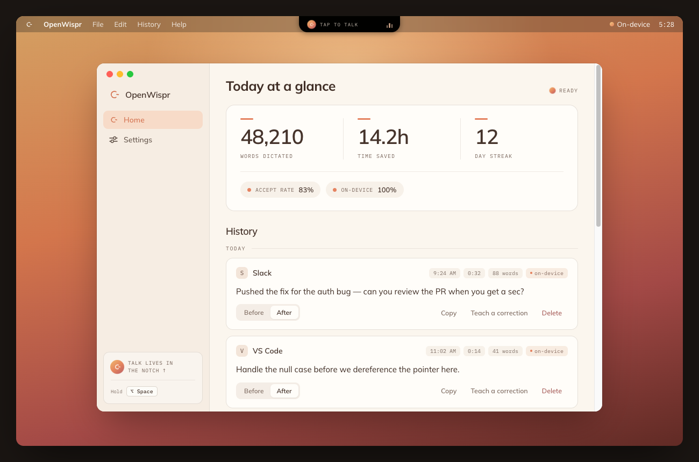
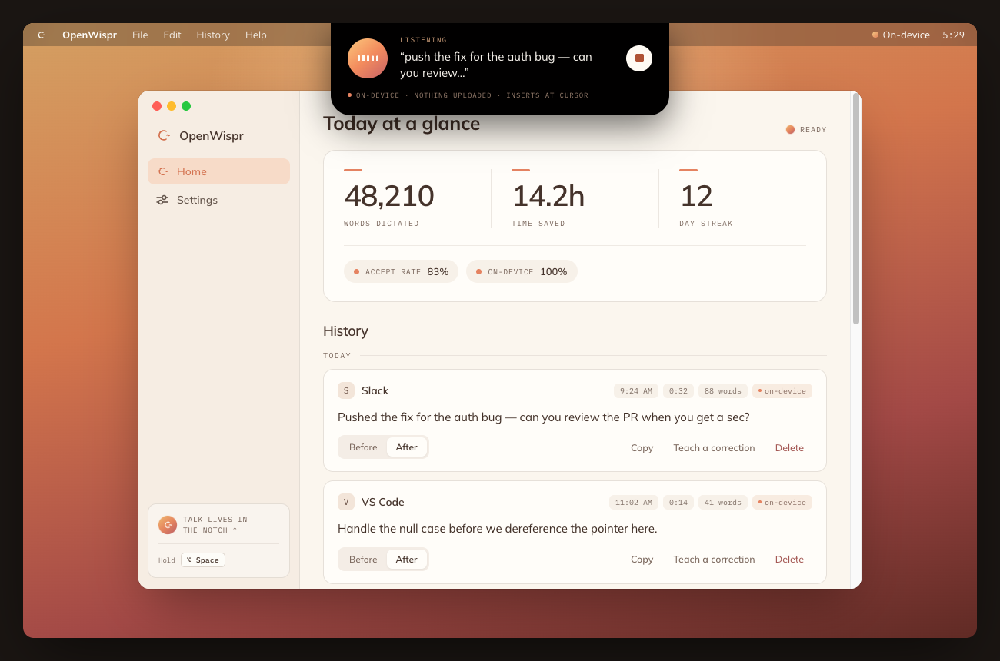
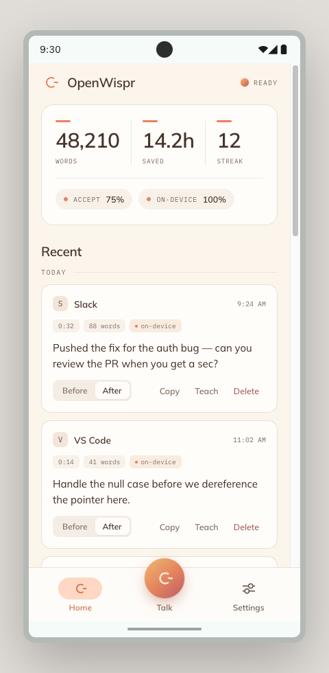
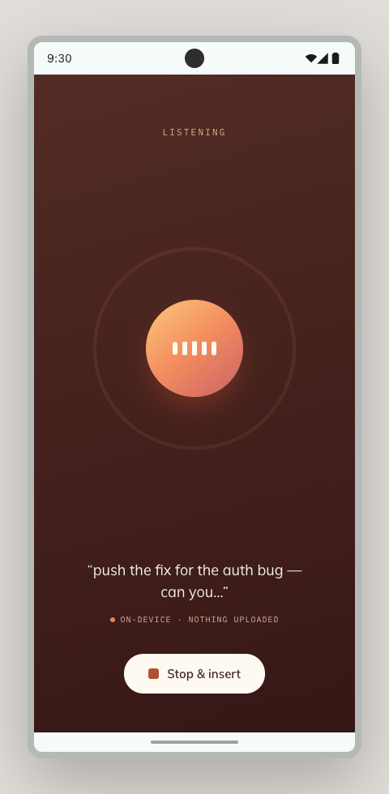

# OpenWispr

> **Speak. It types.** An open-source, Wispr Flow-style voice tool that turns speech into
> clean, in-your-voice text and inserts it straight into the field you're in — with the whole
> pipeline able to run **fully on-device**.

OpenWispr listens, transcribes, cleans up the transcript deterministically, optionally polishes
it with a small on-device LLM, and auto-inserts the result into whatever app you're using. It
learns your vocabulary and style the more you use it, and keeps everything on your device unless
you explicitly choose a cloud provider.

## Screenshots

<div align="center">

**macOS** — a menu-bar app; talk lands in the notch and inserts straight at your cursor.





**Android** — home feed and the on-device listening overlay.


&nbsp;&nbsp;&nbsp;


</div>

## Why OpenWispr

Most voice-dictation tools send your audio to the cloud. OpenWispr can run the entire pipeline
locally, and it's open source — so you can read exactly what it does, swap the models, and keep
your words on your own device.

| | OpenWispr | Typical cloud dictation (e.g. Wispr Flow) |
|---|---|---|
| Runs fully on-device | ✅ optional, end-to-end | ☁️ audio processed in the cloud |
| Open source | ✅ MIT | ❌ |
| Your audio & text stay local | ✅ (unless you pick a cloud provider) | ❌ sent to a server |
| Swappable / custom models | ✅ Whisper + any GGUF LLM | ❌ |
| Custom cleanup model | ✅ our fine-tune, or bring your own | ❌ |
| Price | ✅ free | 💳 subscription |

*(A comparison of approach, not a feature-by-feature benchmark — Wispr Flow is a polished
cloud product; OpenWispr's bet is local-first and open.)*

## Platforms

| Platform | Status | Location |
|---|---|---|
| Android | Active | [`android/`](android/) |
| macOS | Beta | [`macos/`](macos/) |
| iOS / others | Future | — |

Both native apps share one deterministic-cleanup pipeline contract (the Android `textproc`
package is ported 1:1 to Swift in `macos/OpenWisprCore`) and one prompt/tone contract
(see [`shared/prompts/`](shared/prompts/)), so behavior stays in sync across platforms.

## Install

Grab the latest build from the [**Releases**](../../releases/latest) page (currently **v0.1.0**,
the first beta).

### Android

*Requires Android 7.0+ on an **arm64** device.*

1. Download **`OpenWispr-v0.1.0.apk`** from the latest release.
2. Open it. The first time you sideload, Android asks you to allow your browser / Files app to
   **install unknown apps** — enable it, then tap back.
3. Tap **Install**, then open OpenWispr.
4. Grant the two permissions it requests:
   - **Microphone** — so it can hear you.
   - **Accessibility service** (*Settings → Accessibility → OpenWispr*) — so it can type the
     cleaned text into the focused field of other apps.

Updating later: just install a newer release `.apk` over the top — it's the same signing key, so
it upgrades in place.

### macOS

*Requires macOS 13.3 (Ventura) or later. Apple Silicon or Intel.*

1. Download **`OpenWispr-0.1.0.dmg`** from the latest release.
2. Open the `.dmg` and drag **OpenWispr** into **Applications**.
3. The app is self-signed (not yet notarized), so on first launch Gatekeeper blocks it.
   **Right-click the app → Open** and confirm once — or run:
   ```bash
   xattr -dr com.apple.quarantine /Applications/OpenWispr.app
   ```
4. When prompted, grant **Microphone** and **Accessibility**
   (*System Settings → Privacy & Security → Accessibility*) so it can listen and insert text.

> Prefer to build from source? See the platform folders — [`android/`](android/) and
> [`macos/`](macos/).

## How it works

```
mic → VAD → STT → personal-vocab correction → deterministic cleanup
    → (optional) on-device LLM polish → auto-insert
```

- **STT** — speech-to-text via on-device **whisper.cpp** (or Apple Speech on macOS), or an
  OpenAI-compatible cloud endpoint. Your vocabulary biases the decoder so names and jargon land.
- **Deterministic cleanup** (pure, zero-latency): removes fillers, normalizes spoken forms and
  numbers, resolves self-corrections ("send it to Mark, I mean John"), formats lists, fixes
  capitalization. This is the strong default and runs with no model at all.
- **LLM polish** (opt-in, Off / Light / Medium / Full): a small **local** model (via
  llama.cpp) — or a cloud provider — refines further, guarded against over-editing so it never
  invents content or balloons a short phrase. On a guard trip it falls back to the deterministic
  output, so you always get at least the clean version.
- **Personalization**: your corrections feed a personal dictionary + STT bias, and your closest
  past edits become few-shot examples that nudge the polish toward how *you* write. See
  [`docs/personalization.md`](docs/personalization.md).
- **Auto-insert**: the cleaned text is typed into the focused field of whatever app you're in
  (Accessibility on macOS, an accessibility service on Android), with a clipboard fallback.

## Privacy & running locally

In the default local configuration, **nothing leaves your device**: on-device Whisper STT,
on-device LLM polish, local deterministic cleanup, and a local vocabulary/history. The only
network access in local mode is a **one-time model download** from Hugging Face the first time
you enable Whisper or LLM polish. Cloud STT and cloud LLM providers are strictly opt-in, chosen
in Settings. Your personalization data (dictionary, edit history) never leaves the device.

## The cleanup model (our core competence)

Generic small LLMs are mediocre at "clean up this dictation without changing it" — they
paraphrase, over-format, and hallucinate. So we fine-tuned our own: **OpenWispr Cleanup**
(Qwen3-0.6B), trained specifically for faithful, voice-preserving transcript cleanup and
published as a GGUF on Hugging Face. Select it as the polish model and it downloads once.

The **training pipeline, datasets, and evaluation live in a separate repo**
(`openwispr-finetune`) and are not part of this tree — this repo ships the app and points at the
hosted model.

## Repository layout

```
openwispr/
├── android/        Android app (Kotlin / Jetpack Compose)
├── macos/          macOS app (SwiftUI menu-bar) + OpenWisprCore Swift package
├── shared/         cross-platform prompt + tone contract (source of truth)
├── docs/           personalization design
└── design_assets/  brand identity
```

## Build & test

**Android** (JDK 17 — Android Studio bundles it; NDK + CMake for the on-device modules):

```bash
cd android
./gradlew :app:assembleDebug :app:testDebugUnitTest
```

**macOS** (Xcode 15+, macOS 13.3+):

```bash
cd macos/App && ./generate.sh && open OpenWispr.xcodeproj   # build & run in Xcode
cd macos/OpenWisprCore && swift test                        # deterministic-pipeline tests
```

See [`android/README.md`](android/README.md) and [`macos/README.md`](macos/README.md) for
per-platform detail.

## License

MIT — see [LICENSE](LICENSE).
